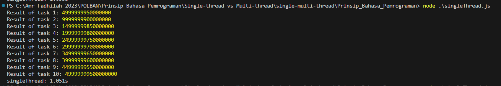
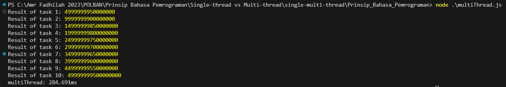

# ***Single-threaded vs Multi-threaded***

## Landasan Teori

### Single-threading

Node.js adalah platform JavaScript yang menggunakan model single-threaded event loop, yang memungkinkan pemrosesan non-blocking dengan cara menangani tugas-tugas asinkron seperti I/O, operasi jaringan, dan operasi file dalam satu thread utama. Pendekatan ini sangat efisien untuk aplikasi yang bersifat I/O-bound, di mana operasi I/O dapat dilakukan tanpa memblokir eksekusi kode lainnya.
Namun, dalam tugas-tugas yang bersifat CPU-bound (seperti perhitungan matematis yang berat), model ini memiliki kelemahan karena operasi yang memakan waktu lama dapat memblokir thread utama, sehingga menghambat responsivitas aplikasi.

### Multi-threading

Node.js versi terbaru mendukung multi-threading melalui modul Worker Threads. Worker Threads memungkinkan eksekusi kode JavaScript dalam thread terpisah, sehingga tugas-tugas berat dapat dijalankan secara paralel tanpa memblokir event loop utama. Ini menjadikan worker threads sangat berguna untuk tugas-tugas CPU-bound yang intensif, di mana beberapa operasi berat dapat dijalankan secara paralel untuk meningkatkan performa keseluruhan.

### Perbandingan Performa Single-threading vs Multi-threading

- **Single-threading**: Pendekatan ini lebih sederhana dan efisien untuk tugas-tugas ringan atau I/O-bound, tetapi kurang cocok untuk tugas-tugas berat yang memerlukan banyak sumber daya CPU.
- **Multi-threading**: Dengan memanfaatkan beberapa core CPU, multi-threading dapat mempercepat eksekusi tugas-tugas berat dengan menjalankannya secara paralel, meskipun dengan biaya tambahan dalam hal manajemen thread dan overhead memori.

## Alat yang Digunakan

- **Node.js** (versi terbaru) yang mendukung **worker threads**.
- **Editor Teks** atau **IDE** seperti **Visual Studio Code** untuk menulis dan mengedit skrip JavaScript.
- **Terminal** atau **Command Prompt** untuk menjalankan skrip dan memantau hasilnya.

## Metode Eksperimen

### **1. Persiapan Lingkungan**

- **Instalasi Node.js**: Pastikan Node.js versi terbaru telah diinstal pada komputer yang digunakan.
- **Penyiapan Skrip**: Siapkan dua set skrip yang akan digunakan untuk eksperimen:
  - **Single-threading**: Skrip `singleThread.js` yang menjalankan tugas berat secara berurutan dalam satu thread.
  - **Multi-threading**: Skrip `multiThread.js` dan `worker.js` yang menjalankan tugas berat secara paralel menggunakan beberapa worker threads.

### **2. Pelaksanaan Eksperimen**

- **Langkah 1: Pengukuran Performa Single-threading**
     1. **Jalankan Skrip Single-threading**: Buka terminal atau command prompt dan jalankan skrip `singleThread.js` dengan perintah:

        ```bash
        node singleThread.js
        ```

     2. **Catat Waktu Eksekusi**: Perhatikan waktu eksekusi yang dilaporkan oleh `console.time` dan `console.timeEnd`. Ini adalah durasi yang dibutuhkan untuk menyelesaikan semua tugas secara berurutan dalam satu thread.

- **Langkah 2: Pengukuran Performa Multi-threading**
  
     1. **Jalankan Skrip Multi-threading**: Buka terminal atau command prompt dan jalankan skrip `multiThread.js` dengan perintah:

        ```bash
        node multiThread.js
        ```

     2. **Catat Waktu Eksekusi**: Perhatikan waktu eksekusi yang dilaporkan oleh `console.time` dan `console.timeEnd`. Ini adalah durasi yang dibutuhkan untuk menyelesaikan semua tugas secara paralel menggunakan beberapa worker threads.

## Eksperimen menggunakan Node.js

### Single-threading dengan Event Loop


**Single-thread: 1.051s**

### Mutli-threading dengan Worker Threads


**Multi-thread: 284.691ms**

## Analisis Performa

1. **Peningkatan Kecepatan Signifikan:** Eksekusi multi-thread menunjukkan peningkatan kecepatan yang sangat signifikan dibandingkan dengan single-thread. Multi-thread menyelesaikan tugas dalam waktu sekitar 27% dari waktu yang dibutuhkan oleh single-thread, menunjukkan efisiensi yang jauh lebih tinggi.
2. **Efektivitas Paralelisme:** Hasil ini mendemonstrasikan efektivitas penggunaan worker threads dalam Node.js untuk tugas-tugas yang bersifat CPU-intensive. Dengan memanfaatkan multiple cores, aplikasi dapat menjalankan perhitungan secara paralel, secara substansial mengurangi waktu eksekusi total.
3. **Konsistensi Hasil:** Meskipun waktu eksekusi berbeda, hasil perhitungan untuk setiap tugas identik antara versi single-thread dan multi-thread. Ini menunjukkan bahwa paralelisme tidak mempengaruhi akurasi atau konsistensi output.
4. **Overhead Multi-threading:** Meskipun multi-threading jauh lebih cepat, ada overhead terkait dengan pembuatan dan manajemen worker threads. Namun, untuk tugas-tugas berat seperti dalam eksperimen ini, keuntungan dari paralelisme jauh melebihi overhead tersebut.
5. **Skalabilitas:** Pendekatan multi-thread menunjukkan potensi skalabilitas yang lebih baik. Saat jumlah atau kompleksitas tugas meningkat, pendekatan multi-thread kemungkinan akan menunjukkan peningkatan performa yang lebih signifikan dibandingkan single-thread.

## Kesimpulan

Eksperimen ini secara jelas mendemonstrasikan keunggulan pendekatan multi-threading untuk tugas-tugas komputasi intensif dalam Node.js. Dengan peningkatan kecepatan lebih dari 3 kali lipat, penggunaan worker threads terbukti sangat efektif dalam meningkatkan performa aplikasi untuk skenario yang melibatkan perhitungan berat. Namun, penting untuk dicatat bahwa efektivitas multi-threading akan bervariasi tergantung pada sifat spesifik tugas dan arsitektur sistem yang digunakan. Pengembang harus melakukan analisis dan pengujian yang cermat untuk menentukan pendekatan terbaik untuk kasus penggunaan spesifik mereka.
