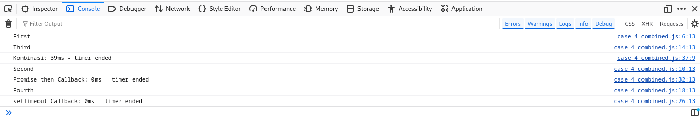

# 03 - Event Loop dan Call Stack

Eksperimen ini menganalisis bagaimana event loop dan call stack bekerja pada bahasa pemograman JavaScript.

## 1. Identifikasi Problem

Event loop dan call stack merupakan mekanisme yang terdapat pada JavaScript. Tanpa adanya kedua mekanisme ini, maka fitur asynchronous yang ada pada JavaScript tidak dapat berjalan. Karena itu, sangat penting bagi para pemrogram untuk memahami bagaimana kedua mekanisme ini bekerja.

## 2. Deskripsi Problem

Event loop merupakan mekanisme yang terdapat pada JavaScript yang membuat program dapat berjalan secara non-blocking. Call stack juga berperan untuk membuat prioritas yang menentukan perintah apa yang akan berjalan terlebih dahulu.

Behavior dari kedua mekanisme ini adalah sebagi berikut:

1. Call Stack
    - Merupakan struktur data tumpukan yang digunakan oleh JavaScript untuk melacak eksekusi fungsi dalam program.
    - Hanya satu fungsi yang dapat dieksekusi dalam satu waktu.
    - Setiap fungsi yang dipanggil akan ditempatkan ke dalam Call Stack dan akan dieksekusi dari atas ke bawah.

2. Event Loop
    - Sebuah mekanisme dalam JavaScript yang memastikan bahwa operasi asynchronous dieksekusi setelah Call Stack kosong.
    - Mengambil tugas dari callback queue dan memasukkannya ke dalam Call Stack untuk dieksekusi.

Dari behavior ini, experimen yang akan dilakukan akan berfokus pada bagaimana call stack dan event loop bekerja serta bagaimana JavaScript memprioritaskan suatu proses diatas yang lain.

## 3. Metodologi Experiment

- Membuat beberapa kasus kode JavaScript, seperti ketika semua perintah berjalan synchronous, ketika terdapat promises, dan lain-lain.
- Memonitor waktu yang digunakan untuk setiap perintah.
- Menggunakan debugger untuk melihat urutan perintah yang dijalankan.

## 4. Pelaksanaan Experiment

Untuk melakukan eksperimen, gunakan browser debugger untuk membuka file `sample.html`. Setelah itu anda dapat mencoba setiap kasus dari `case_1_synchronous_function.js` hingga `case_4_combined.js` dengan mengedit file `sample.html` pada bagian include JavaScript.

```html
<!DOCTYPE html>
<html lang="en">
<head>
    <meta charset="UTF-8">
    <meta name="viewport" content="width=device-width, initial-scale=1.0">
    <title>Case 3 Test</title>
</head>
<body>
    Body of the HTML

    <!-- Disini anda dapat mencoba setiap kasus dengan comment/uncomment include JavaScript di bawah ini -->
    <!-- <script src="case_1_synchronous_function.js"></script> -->
    <!-- <script src="case_2_asynchronous_function.js"></script> -->
    <!-- <script src="case_3_promises.js"></script> -->
    <script src="case_4_combined.js"></script>
</body>
</html>
```

Dan berikut adalah hasil dari `case_4_combined.js`



Klik link di bawah ini untuk melihat setiap file JavaScript yang ada pada experimen ini

- [case_1_synchronous_function.js](case_1_synchronous_function.js)
- [case_2_asynchronous_function.js](case_2_asynchronous_function.js)
- [case_3_promises.js](case_3_promises.js)
- [case_4_combined.js](case_4_combined.js)

## 5. Analisis Hasil Experiment

1. JavaScript adalah Single-threaded:
    - JavaScript berjalan dalam satu thread eksekusi, yang berarti hanya satu operasi yang bisa dijalankan pada satu waktu. Ini mengarah pada keterbatasan dalam menjalankan operasi secara paralel atau concurrent.

2. Call Stack:
    - Call Stack adalah tumpukan yang menyimpan dan melacak fungsi yang sedang dan akan dieksekusi. Ketika sebuah fungsi dipanggil, ia ditempatkan di atas Call Stack, dan ketika selesai, ia dihapus dari Call Stack.
    - Karena sifat single-threaded, jika ada operasi synchronous yang memakan waktu lama di Call Stack, seluruh eksekusi kode lain akan terblokir sampai operasi tersebut selesai.

3. Event Loop:
    - Event Loop adalah mekanisme yang mengelola bagaimana tugas asynchronous dieksekusi. Event Loop terus memantau Call Stack dan memastikan bahwa setelah Call Stack kosong, tugas-tugas dari microtask queue dan macrotask queue (callback queue) dapat diproses.
    - Ini memungkinkan JavaScript untuk tetap responsif meskipun ada operasi asynchronous yang sedang menunggu untuk dieksekusi.

4. Microtask Queue vs. Macrotask Queue:
    - Microtask Queue: Tugas-tugas ini, seperti Promise dengan .then() atau MutationObserver, memiliki prioritas lebih tinggi dan akan dieksekusi sebelum tugas-tugas di macrotask queue.
    - Macrotask Queue (Callback Queue): Ini berisi tugas-tugas yang biasanya dihasilkan oleh setTimeout, setInterval, atau event handlers. Tugas-tugas di sini diproses setelah semua tugas di microtask queue selesai.

5. Asynchronous Programming:
    - JavaScript mengatasi keterbatasan single-threaded dengan asynchronous programming. Dengan menggunakan mekanisme seperti setTimeout, Promise, dan async/await, JavaScript dapat menunda eksekusi tugas-tugas yang memakan waktu dan menjalankan kode lain sementara menunggu.
    - Asynchronous programming memungkinkan JavaScript untuk menghindari pemblokiran (non-blocking), tetapi ini tidak berarti JavaScript berjalan secara concurrent. Eksekusi tetap dikelola dalam satu thread.

6. Konsep Macrotask dan Microtask:
    - Macrotask adalah tugas yang dieksekusi setelah semua tugas synchronous selesai. Contoh macrotask termasuk callback dari setTimeout.
    - Microtask memiliki prioritas lebih tinggi dan dieksekusi sebelum macrotask, meskipun ditambahkan ke antrian setelahnya. Contoh microtask termasuk callback dari Promise.

7. Pentingnya Event Loop dalam Responsivitas:
    - Event Loop memastikan bahwa JavaScript tetap responsif dengan memprioritaskan tugas asynchronous setelah Call Stack kosong, memungkinkan tugas-tugas kecil dan cepat (microtasks) untuk diselesaikan segera sebelum beralih ke tugas yang lebih besar dan lambat (macrotasks).
