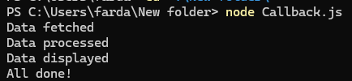
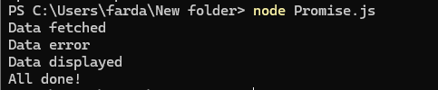

# **04 - Callback Hell vs Promise Chain**
Callback hell dan promise chain adalah dua konsep yang sering muncul saat menangani operasi asinkron dalam JavaScript.

## **Callback Hell**
### **Pengertian Callback Hell**
Callback Hell terjadi ketika terdapat banyak callback yang bersarang dalam kode, terutama saat menangani operasi asinkron yang harus dilakukan secara berurutan. Hal ini mengakibatkan kode menjadi sulit dibaca dan juga dikelola. Setiap Callback bergantung/berhubungan pada hasil operasi Callback sebelumnya. Sehingga menghasilkan struktur kode yang menyerupai piramida atau tangga. Semakin banyak operasi yang dilakukan semakin dalam dan kompleks struktur Callback-nya.

### **Kapan Digunakan**
1. Saat operasi yang dilakukan sederhana dan tidak mementikan urutan.
2. Saat sedang membangun API atau Library yang memerlukan fungsi tertentu pada event atau tindakan spesifik, karena callback ringan dan mudah dipahami.
3. Callback digunakan pada situasi dimana fungsi harus dipanggil berulang kali, seperti pada event listener.

## **Promise Chain**
### **Pengertian Promise Chain**
Promise Chain adalah metode untuk menangani operasi asinkron secara berurutan dengan menggunakan objek Promise. Pendekatan ini membantu menjaga kode tetap rapi, terstruktur, dan lebih mudah dibaca dibandingkan dengan callback bersarang.

### **Kapan Digunakan**
1. Saat memiliki operasi yang asinkron yang harus dieksekusi secara berurutan (memperhatikan urutan)
2. Saat membutuhkan penanganan error disatu tempat.
3. Saat membutuhkan pengembangan aplikasi berskala besar dan kompleks.

## Metode Ekperimen
1. Install Node.js versi terbaru pada komputer.
2. Buat 2 file yang digunakan untuk eksperimen:
        - **File `Callback.js`:** digunakan untuk mencontohkan bagaimana Callback Hell terjadi dalam kode.
        - **File `Promise.js`:** digunakan untuk menunjukkan bagaimana Promise Chain dapat menggantikan Callback Hell dengan struktur kode yang lebih rapi.
3. Jalankan masing masing file menggunakan Node.js di terminal untuk melihat perbedaan dalam alur eksekusi dan bagaimana masing-masing pendekatan menangani operasi asinkron.
```bash
node Callback.js
node PromiseChain.js

4. Analisis Hasil
Callback.js
    
    Pada file Callback.js, hasil menunjukkan bahwa operasi asinkron berhasil dieksekusi, namun struktur kode yang dihasilkan terlihat sangat kompleks dan sulit diikuti. Callback yang bersarang dalam beberapa tingkat menghasilkan pola piramida yang menyebabkan apa yang disebut sebagai "Callback Hell". Hal ini membuat kode menjadi sulit untuk dibaca, diuji, dan di-debug. Masalah ini semakin nyata ketika ada kebutuhan untuk menambahkan operasi tambahan atau melakukan penanganan error di beberapa tempat. Setiap tambahan callback hanya memperburuk masalah, membuat kode menjadi semakin tidak terkelola.
Promise.js
    
    Pada file Promise.js, operasi asinkron yang sama dilakukan, tetapi kali ini menggunakan Promise Chain. Hasil yang dihasilkan sama seperti pada Callback.js, namun struktur kode jauh lebih rapi dan mudah diikuti. Dengan menggunakan chaining pada Promise, setiap operasi asinkron diatur dalam urutan yang lebih linear dan terstruktur. Keuntungan besar dari pendekatan ini adalah kemampuan untuk menangani error di satu tempat dengan menggunakan .catch() di akhir chain. Hal ini tidak hanya meningkatkan keterbacaan kode, tetapi juga membuatnya lebih mudah di-debug dan dipelihara. Selain itu, menambahkan operasi tambahan dalam chain ini jauh lebih mudah dan tidak mengorbankan keterbacaan kode.

Kesimpulan:

Meskipun kedua metode mampu menangani operasi asinkron, Promise Chain jelas menawarkan pendekatan yang lebih baik dalam hal keterbacaan, pemeliharaan, dan penanganan error. Callback Hell, meskipun mungkin bekerja untuk operasi sederhana, dengan cepat menjadi tidak praktis dan sulit dikelola seiring dengan peningkatan kompleksitas. Di sisi lain, Promise Chain memberikan solusi yang lebih elegan, memungkinkan pengembang untuk menulis kode yang lebih bersih dan terorganisir, yang sangat penting dalam pengembangan aplikasi berskala besar dan kompleks.

Dalam pengembangan modern, terutama dengan adanya fitur seperti async/await yang lebih lanjut menyederhanakan penanganan operasi asinkron, penggunaan callback bersarang sangat jarang direkomendasikan. Memahami dan beralih ke penggunaan Promise dan Promise Chain adalah langkah yang penting untuk menulis kode JavaScript yang lebih baik dan lebih efisien.