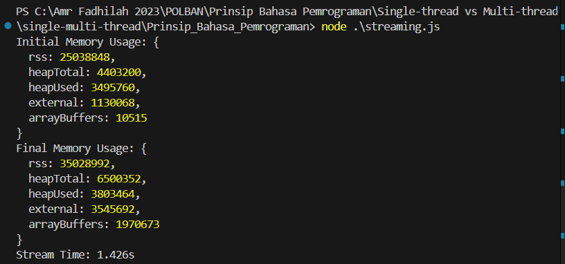
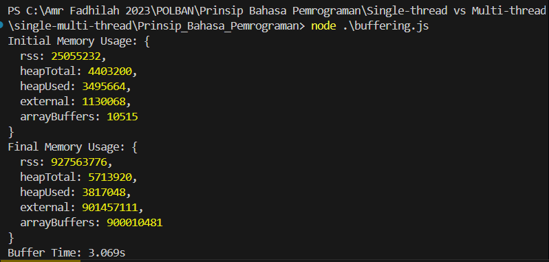

# ***Streaming vs. Buffering dalam Operasi I/O***

## **Tujuan Eksperimen**

Eksperimen ini bertujuan untuk:

- **Mengukur dan membandingkan kecepatan eksekusi** antara metode streaming dan buffering dalam operasi I/O menggunakan Node.js.
- **Mengukur penggunaan memori (RAM)** selama eksekusi operasi I/O dengan menggunakan metode streaming dan buffering dalam Node.js.
- **Mengevaluasi efisiensi dan performa** dari kedua metode tersebut dalam skenario penanganan file besar, untuk memberikan rekomendasi tentang metode yang lebih sesuai berdasarkan kebutuhan spesifik aplikasi.

## **Landasan Teori**

### **a. Node.js dan Operasi I/O**

Node.js adalah platform JavaScript yang dibangun di atas mesin V8 Google Chrome yang memungkinkan pengembangan aplikasi server-side. Node.js dikenal karena kemampuan I/O non-blocking dan event-driven-nya, yang membuatnya sangat efisien dalam menangani aplikasi yang membutuhkan skalabilitas tinggi.

### **b. Streaming**

Streaming adalah teknik di mana data dikirimkan secara berkelanjutan dalam potongan kecil yang dapat segera diproses saat diterima. Dalam Node.js, streaming digunakan untuk mengelola operasi I/O secara efisien dengan meminimalkan penggunaan memori dan mengurangi latensi.

- **Contoh:** Ketika membaca file besar, alih-alih memuat seluruh file ke dalam memori sekaligus, data dibaca dalam blok-blok kecil dan diproses segera setelah diterima.

### **c. Buffering**

Buffering adalah proses di mana data disimpan sementara di dalam memori (buffer) sebelum diproses atau dikirim ke tujuan akhir. Buffering memungkinkan data dikumpulkan dalam jumlah besar sebelum diproses, tetapi bisa menyebabkan penggunaan memori yang lebih besar dan peningkatan latensi.

- **Contoh:** Ketika membaca file, seluruh file mungkin dimuat ke dalam buffer sebelum diproses atau ditulis ke lokasi lain.

### **d. Performa dalam Node.js**

Performa dalam konteks ini merujuk pada dua aspek utama: kecepatan eksekusi (waktu yang dibutuhkan untuk menyelesaikan operasi I/O) dan penggunaan memori (jumlah memori yang digunakan selama operasi berlangsung). Streaming diharapkan lebih efisien dalam hal penggunaan memori, sementara buffering mungkin lebih efisien dalam operasi batch.

## **Alat dan Bahan**

### **a. Software**

- **Node.js:** Versi terbaru dari Node.js harus terinstal pada sistem yang akan digunakan untuk menjalankan eksperimen.
- **Code Editor:** Sebuah code editor seperti Visual Studio Code untuk menulis dan mengedit skrip Node.js.
- **Windows PowerShell atau Command Prompt:** Untuk menjalankan perintah pembuatan file dummy dan menjalankan skrip Node.js.

### **b. File Dummy**

- **File Teks Berukuran Besar:** File dummy yang dibuat menggunakan PowerShell atau Command Prompt sesuai instruksi di atas, dengan ukuran yang cukup besar (misalnya 100 MB hingga 1 GB) untuk menunjukkan perbedaan yang signifikan dalam performa. (File .txt yang digunakan pada eksperimen adalah 878.9 MB)

### **c. Alat Pengukuran**

- **Process Memory Usage:** Untuk mengukur penggunaan memori selama eksperimen, menggunakan fungsi `process.memoryUsage()` di Node.js.
- **Timer (**`console.time()` **dan** `console.timeEnd()`**):** Untuk mengukur waktu eksekusi dari operasi streaming dan buffering dalam Node.js.

## Metode Eksperimen

### **1. Persiapan Lingkungan**

- **Instalasi Node.js**: Pastikan Node.js versi terbaru telah diinstal pada komputer yang digunakan.
- **Penyiapan Skrip**: Siapkan dua set skrip yang akan digunakan untuk eksperimen:
  - **Streaming**: Skrip `streaming.js` yang membaca dan menulis file teks berukuran besar dengan metode streaming.
  - **Buffering**: Skrip `buffering.js` yang membaca dan menulis file teks berukuran besar dengan metode buffering.

### **2. Pelaksanaan Eksperimen**

- **Langkah 1: Siapkan File Dummy**
     1. **Buat File Teks:** Buat file teks besar yang akan digunakan sebagai input dalam eksperimen. Anda dapat membuatnya dengan menggunakan PowerShell atau Command Prompt sesuai langkah-langkah yang telah dijelaskan sebelumnya. Misalnya, buat file sebesar 100 MB - 1 GB untuk mendapatkan hasil yang signifikan. Dapat dilakukan dengan perintah:

        ```bash
        $text = "This is a dummy text line to fill the file.\n" * 7500000 
        $text | Out-File -FilePath "dummyfile.txt"
        ```

- **Langkah 2: Pengukuran Performa Streaming**
     1. **Jalankan Skrip Streaming**: Buka terminal atau command prompt dan jalankan skrip `streaming.js` dengan perintah:

        ```bash
        node streaming.js
        ```

     2. **Catat Waktu Eksekusi**: Perhatikan waktu eksekusi yang dilaporkan oleh `console.time` dan `console.timeEnd`. Ini adalah durasi yang dibutuhkan untuk menyelesaikan semua tugas secara berurutan dalam satu thread.
     3. **Catat Penggunaan Memori**: Perhatikan memori yang digunakan sebelum program dijalankan dan sesudah program dijalankan untuk mendapatkan penggunaan memori dari program tersebut.

- **Langkah 3: Pengukuran Performa Streaming**
  
     1. **Jalankan Skrip Buffering**: Buka terminal atau command prompt dan jalankan skrip `buffering.js` dengan perintah:

        ```bash
        node buffering.js
        ```

     2. **Catat Waktu Eksekusi**: Perhatikan waktu eksekusi yang dilaporkan oleh `console.time` dan `console.timeEnd`. Ini adalah durasi yang dibutuhkan untuk menyelesaikan semua tugas secara paralel menggunakan beberapa worker threads.
     3. **Catat Penggunaan Memori**: Perhatikan memori yang digunakan sebelum program dijalankan dan sesudah program dijalankan untuk mendapatkan penggunaan memori dari program tersebut.

## Eksperimen menggunakan Node.js

### Streaming



**Time:** 1.426s  
**RSS:** 9.990.144 bytes (~10 MB)

### Buffering



**Time:** 3.069s  
**RSS:** 902.508.544 bytes (~902.5 MB)

## Hasil Analisis dan Pembahasan

### 1. Waktu Eksekusi

- **Streaming:** 1.426 detik
- **Buffering:** 3.069 detik

Analisis: Metode streaming menunjukkan kinerja yang jauh lebih cepat, dengan waktu eksekusi hampir 2.15 kali lebih cepat dibandingkan metode buffering. Ini menunjukkan bahwa untuk file berukuran besar, streaming memberikan keunggulan signifikan dalam hal kecepatan pemrosesan.

### 2. Penggunaan Memori (RSS - Resident Set Size)

- **Streaming:**
  - Awal: 25.038.848 bytes (~25 MB)
  - Akhir: 35.028.992 bytes (~35 MB)
  - Peningkatan: ~10 MB

- **Buffering:**
  - Awal: 25.055.232 bytes (~25 MB)
  - Akhir: 927.563.776 bytes (~927.5 MB)
  - Peningkatan: ~902.5 MB

Analisis: Perbedaan penggunaan memori antara kedua metode sangat signifikan. Metode streaming hanya mengalami peningkatan penggunaan memori sekitar 10 MB, sementara metode buffering mengalami peningkatan drastis sebesar 902.5 MB. Ini menunjukkan efisiensi memori yang jauh lebih baik pada metode streaming.

### 3. Efisiensi dan Performa

- **Streaming:**
  - Lebih efisien dalam penggunaan memori
  - Waktu eksekusi lebih cepat
  - Cocok untuk pemrosesan file besar dan aplikasi real-time

- **Buffering:**
  - Penggunaan memori yang intensif
  - Waktu eksekusi lebih lama
  - Mungkin lebih cocok untuk file kecil atau ketika seluruh konten file diperlukan sekaligus

### 4. Implikasi Praktis

1. **Skalabilitas:** Metode streaming memungkinkan aplikasi untuk menangani file yang jauh lebih besar dari memori yang tersedia, meningkatkan skalabilitas aplikasi.

2. **Responsivitas:** Dengan waktu eksekusi yang lebih cepat, streaming dapat meningkatkan responsivitas aplikasi, terutama dalam skenario real-time atau high-concurrency.

3. **Efisiensi Sumber Daya:** Penggunaan memori yang lebih rendah pada streaming memungkinkan server untuk menangani lebih banyak permintaan secara bersamaan tanpa kehabisan sumber daya.

4. **Kasus Penggunaan:** Streaming sangat cocok untuk aplikasi yang memproses data secara berkelanjutan seperti video streaming, analisis log real-time, atau pemrosesan data IoT.

## Kesimpulan

Kesimpulannya, metode streaming menunjukkan keunggulan yang signifikan dalam hal kecepatan dan efisiensi memori, terutama untuk pemrosesan file berukuran besar. Penggunaan streaming dapat secara substansial meningkatkan performa dan skalabilitas aplikasi Node.js yang melibatkan operasi I/O intensif.
